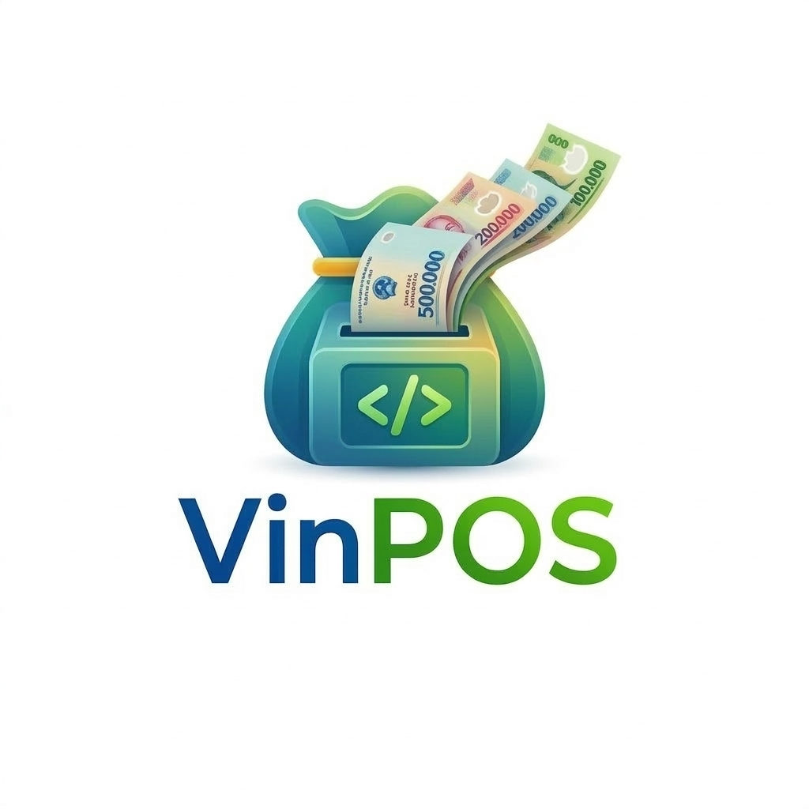

<p align="center">
  
</p>

<h1 align="center">VinPOS - Hệ Thống Quản Lý Bán Hàng Thông Minh</h1>

<p align="center">
  <strong>Point of Sale & Shop Management System</strong><br/>
  Giải pháp quản lý cửa hàng toàn diện — bán hàng, kho hàng, khách hàng, báo cáo & in hóa đơn.
</p>

<p align="center">
  
  
  
  
  
</p>

---

## 📋 Mục lục

- [Tổng quan](#-tổng-quan)
- [Tính năng](#-tính-năng)
- [Công nghệ](#-công-nghệ)
- [Cài đặt](#-cài-đặt)
- [Cấu hình](#️-cấu-hình)
- [Sử dụng](#-sử-dụng)
- [Cấu trúc dự án](#-cấu-trúc-dự-án)
- [API Endpoints](#-api-endpoints)
- [Tài khoản demo](#-tài-khoản-demo)
- [Screenshots](#-screenshots)
- [Đóng góp](#-đóng-góp)
- [Giấy phép](#-giấy-phép)

---

## 🎯 Tổng quan

**VinPOS** là hệ thống quản lý bán hàng (POS) dành cho cửa hàng bán lẻ, được xây dựng với giao diện hiện đại, tối ưu trải nghiệm người dùng. Hệ thống hỗ trợ đầy đủ các tính năng từ bán hàng, quản lý kho, khách hàng đến báo cáo doanh thu chi tiết.

### Đặc điểm nổi bật

- 🎨 **Giao diện Apple-inspired** — Thiết kế sáng, tối giản, chuyên nghiệp
- 📱 **Responsive** — Chạy mượt trên mọi thiết bị (desktop, tablet, mobile)
- ⚡ **Realtime** — Cập nhật dữ liệu tức thì
- 🖨️ **In hóa đơn** — Hỗ trợ máy in bill 58mm/80mm, xem trước phiếu in
- 📊 **Báo cáo nâng cao** — Biểu đồ, xuất Excel, phân tích theo ngày/tháng/quý/năm
- 🔐 **Phân quyền 3 cấp** — Admin hệ thống, Chủ shop, Nhân viên

---

## ✨ Tính năng

### 🛒 Bán hàng (POS)
- Giao diện POS fullscreen chuyên nghiệp
- Tìm kiếm sản phẩm nhanh (F1) + Quét barcode (F3)
- Lọc theo danh mục sản phẩm
- Giỏ hàng: thêm/xóa/sửa số lượng, giảm giá từng sản phẩm
- Chọn khách hàng (F4), ghi chú đơn hàng (F8)
- Thanh toán đa phương thức: tiền mặt, chuyển khoản, thẻ
- Tính tiền thừa tự động
- In hóa đơn sau thanh toán (F2)
- Phím tắt bàn phím cho thao tác nhanh

### 📦 Quản lý sản phẩm
- CRUD sản phẩm đầy đủ (thêm, sửa, xóa)
- Phân loại theo danh mục
- Quản lý tồn kho, cảnh báo hết hàng
- Icon sản phẩm bằng Lucide icons
- Tìm kiếm và lọc nâng cao

### 📁 Danh mục
- Tạo/sửa/xóa danh mục sản phẩm
- Icon tùy chỉnh cho mỗi danh mục
- Đếm số sản phẩm trong danh mục

### 🧾 Đơn hàng
- Danh sách đơn hàng với trạng thái
- Lọc theo trạng thái (chờ xử lý, hoàn thành, hủy, hoàn trả)
- Chi tiết đơn hàng
- In lại hóa đơn

### 👥 Khách hàng
- Quản lý thông tin khách hàng
- Lịch sử mua hàng
- Tìm kiếm nhanh

### 📊 Báo cáo doanh thu
- **Tổng quan**: KPI cards, biểu đồ tổng hợp (doanh thu + đơn hàng + lợi nhuận)
- **Doanh thu**: Area chart, Line chart, bảng chi tiết theo thời gian
- **Sản phẩm**: Top bán chạy, horizontal bar chart, ranking với progress bar
- **Thanh toán**: Pie chart phương thức thanh toán, phân tích tỷ lệ
- **Bộ lọc thời gian**: Hôm nay / Hôm qua / 7 ngày / Tháng / Quý / Năm / Tùy chọn
- **Xuất Excel**: 3 loại báo cáo (doanh thu, sản phẩm, thanh toán)

### ⚙️ Cài đặt
- **Cửa hàng**: Thông tin shop (tên, SĐT, địa chỉ, email, MST)
- **Máy in**: Khổ giấy (58mm/80mm), cỡ chữ, tự động in, in bản sao
- **Phiếu in**: Tùy chỉnh phiếu in (logo, QR, MST, header, footer) + **Live preview**
- **In thử**: Nút in thử với dữ liệu mẫu
- **Thông báo**: Cảnh báo hết hàng, âm thanh, báo cáo hàng ngày

### 🛡️ Admin hệ thống
- Quản lý toàn bộ người dùng
- Quản lý cửa hàng
- Cấu hình hệ thống

### 🔐 Xác thực & Phân quyền
- Đăng nhập / Đăng ký
- JWT Authentication (HttpOnly Cookie)
- 3 vai trò: `admin`, `shop_owner`, `employee`
- 2 chế độ cho shop: **Quản lý** & **Bán hàng (POS)**

---

## 🛠 Công nghệ

| Lớp | Công nghệ |
|-----|-----------|
| **Framework** | [Next.js 16](https://nextjs.org/) (App Router, Turbopack) |
| **Frontend** | [React 19](https://react.dev/), [TypeScript 5](https://www.typescriptlang.org/) |
| **Styling** | [Tailwind CSS 4](https://tailwindcss.com/) |
| **UI Components** | [shadcn/ui](https://ui.shadcn.com/) (Button, Input, Card, Dialog, Select, Switch...) |
| **Icons** | [Lucide React](https://lucide.dev/) |
| **Charts** | [Recharts](https://recharts.org/) (Area, Bar, Line, Pie, Composed) |
| **Animations** | [Framer Motion](https://www.framer.com/motion/) |
| **Database** | [MongoDB](https://www.mongodb.com/) + [Mongoose](https://mongoosejs.com/) |
| **Auth** | JWT ([jose](https://github.com/panva/jose)) + bcryptjs |
| **State** | [Zustand](https://zustand-demo.pmnd.rs/) (persist) |
| **Excel** | [SheetJS (xlsx)](https://sheetjs.com/) |
| **Notifications** | [react-hot-toast](https://react-hot-toast.com/) |
| **Font** | [Inter](https://fonts.google.com/specimen/Inter) (Google Fonts) |

---

## 🚀 Cài đặt

### Yêu cầu

- **Node.js** >= 18
- **MongoDB** >= 6 (chạy local hoặc MongoDB Atlas)
- **npm** hoặc **yarn**

### Bước 1: Clone repository

```bash
git clone https://github.com/your-username/vinpos.git
cd vinpos
```

### Bước 2: Cài đặt dependencies

```bash
npm install
```

### Bước 3: Cấu hình environment

Tạo file `.env.local` tại thư mục gốc:

```env
MONGODB_URI=mongodb://localhost:27017/vinpos
JWT_SECRET=vinpos-super-secret-jwt-key-2024
NEXT_PUBLIC_APP_NAME=VinPOS
```

### Bước 4: Khởi chạy MongoDB

```bash
# Nếu dùng MongoDB local
mongod

# Hoặc dùng Docker
docker run -d -p 27017:27017 --name vinpos-mongo mongo:latest
```

### Bước 5: Khởi chạy development server

```bash
npm run dev
```

Truy cập: [http://localhost:3000](http://localhost:3000)

### Bước 6: Tạo dữ liệu mẫu

Tại trang Login → nhấn nút **"Tạo dữ liệu mẫu"** để seed database với:
- 3 tài khoản demo (Admin, Shop Owner, Nhân viên)
- 1 cửa hàng mẫu
- 6 danh mục + 30 sản phẩm điện tử

---

## ⚙️ Cấu hình

| Biến | Mô tả | Mặc định |
|------|-------|----------|
| `MONGODB_URI` | Connection string MongoDB | `mongodb://localhost:27017/vinpos` |
| `JWT_SECRET` | Secret key cho JWT token | `vinpos-super-secret-jwt-key-2024` |
| `NEXT_PUBLIC_APP_NAME` | Tên ứng dụng hiển thị | `VinPOS` |

> ⚠️ **Lưu ý**: Đổi `JWT_SECRET` thành giá trị khác khi deploy lên production!

---

## 📖 Sử dụng

### Luồng hoạt động

```
Đăng nhập → Chọn chế độ
                ├── 🖥️ Quản lý
                │   ├── Tổng quan (Dashboard)
                │   ├── Sản phẩm
                │   ├── Danh mục
                │   ├── Đơn hàng
                │   ├── Khách hàng
                │   ├── Kho hàng
                │   ├── Báo cáo
                │   └── Cài đặt
                └── 🛒 Bán hàng (POS)
                    └── Giao diện POS fullscreen
```

### Phím tắt POS

| Phím | Chức năng |
|------|----------|
| `F1` | Focus tìm kiếm sản phẩm |
| `F2` | Mở thanh toán |
| `F3` | Quét barcode |
| `F4` | Chọn khách hàng |
| `F8` | Ghi chú đơn hàng |

---

## 📁 Cấu trúc dự án

```
vinpos/
├── app/                          # Next.js App Router
│   ├── (admin)/                  # Admin pages (protected)
│   │   └── admin/
│   │       ├── page.tsx          # Admin Dashboard
│   │       ├── users/            # Quản lý người dùng
│   │       ├── shops/            # Quản lý cửa hàng
│   │       └── settings/         # Cài đặt hệ thống
│   ├── (shop)/                   # Shop pages (protected)
│   │   ├── dashboard/            # Tổng quan
│   │   ├── products/             # Sản phẩm
│   │   ├── categories/           # Danh mục
│   │   ├── orders/               # Đơn hàng
│   │   ├── customers/            # Khách hàng
│   │   ├── inventory/            # Kho hàng
│   │   ├── reports/              # Báo cáo doanh thu
│   │   ├── pos/                  # Bán hàng POS
│   │   └── settings/             # Cài đặt cửa hàng
│   ├── api/                      # API Routes
│   │   ├── auth/                 # Authentication (login/register/logout/me)
│   │   ├── dashboard/            # Dashboard data
│   │   ├── products/             # CRUD Products
│   │   ├── categories/           # CRUD Categories
│   │   ├── orders/               # CRUD Orders
│   │   ├── customers/            # CRUD Customers
│   │   └── seed/                 # Database seeding
│   ├── login/                    # Trang đăng nhập
│   ├── register/                 # Trang đăng ký
│   ├── layout.tsx                # Root layout
│   ├── page.tsx                  # Landing / redirect
│   └── globals.css               # Global styles + Design system
├── components/
│   ├── layout/
│   │   └── app-shell.tsx         # Main layout (sidebar + header)
│   └── ui/                       # shadcn/ui components
├── lib/
│   ├── auth.ts                   # JWT helpers
│   ├── format.ts                 # Format helpers (currency, date, receipt)
│   ├── icons.ts                  # Icon mapping utilities
│   ├── utils.ts                  # General utilities
│   ├── db/
│   │   └── mongodb.ts            # MongoDB connection
│   ├── models/                   # Mongoose models
│   │   ├── User.ts
│   │   ├── Shop.ts
│   │   ├── Product.ts
│   │   ├── Category.ts
│   │   ├── Order.ts
│   │   └── Customer.ts
│   ├── store/
│   │   └── index.ts              # Zustand stores (auth + cart)
│   └── types/
│       └── index.ts              # TypeScript interfaces
├── public/
│   └── logo/
│       └── VinPOS_logo.png       # Logo chính
├── .env.local                    # Environment variables
├── package.json
├── tailwind.config.ts
├── tsconfig.json
└── README.md
```

---

## 🔌 API Endpoints

### Authentication
| Method | Endpoint | Mô tả |
|--------|----------|-------|
| `POST` | `/api/auth/login` | Đăng nhập |
| `POST` | `/api/auth/register` | Đăng ký |
| `POST` | `/api/auth/logout` | Đăng xuất |
| `GET` | `/api/auth/me` | Lấy thông tin user hiện tại |

### Products
| Method | Endpoint | Mô tả |
|--------|----------|-------|
| `GET` | `/api/products` | Danh sách sản phẩm |
| `POST` | `/api/products` | Tạo sản phẩm |
| `PUT` | `/api/products/[id]` | Cập nhật sản phẩm |
| `DELETE` | `/api/products/[id]` | Xóa sản phẩm |

### Categories
| Method | Endpoint | Mô tả |
|--------|----------|-------|
| `GET` | `/api/categories` | Danh sách danh mục |
| `POST` | `/api/categories` | Tạo danh mục |
| `PUT` | `/api/categories/[id]` | Cập nhật danh mục |
| `DELETE` | `/api/categories/[id]` | Xóa danh mục |

### Orders
| Method | Endpoint | Mô tả |
|--------|----------|-------|
| `GET` | `/api/orders` | Danh sách đơn hàng |
| `POST` | `/api/orders` | Tạo đơn hàng |
| `PUT` | `/api/orders/[id]` | Cập nhật trạng thái |

### Customers
| Method | Endpoint | Mô tả |
|--------|----------|-------|
| `GET` | `/api/customers` | Danh sách khách hàng |
| `POST` | `/api/customers` | Tạo khách hàng |

### Other
| Method | Endpoint | Mô tả |
|--------|----------|-------|
| `GET` | `/api/dashboard` | Dữ liệu dashboard |
| `POST` | `/api/seed` | Seed dữ liệu mẫu |

---

## 🔑 Tài khoản demo

Sau khi seed dữ liệu, sử dụng các tài khoản sau:

| Vai trò | Email | Mật khẩu |
|---------|-------|----------|
| 🛡️ Admin | `admin@vinpos.com` | `123456` |
| 🏪 Chủ shop | `shop@vinpos.com` | `123456` |
| 👤 Nhân viên | `nhanvien@vinpos.com` | `123456` |

---

## 📸 Screenshots

### Trang đăng nhập
> Giao diện login với brand panel và form đăng nhập

### Dashboard - Tổng quan
> KPI cards, biểu đồ doanh thu 7 ngày, top sản phẩm, đơn hàng gần đây

### POS - Bán hàng
> Giao diện fullscreen với grid sản phẩm, giỏ hàng, thanh toán đa phương thức

### Báo cáo doanh thu
> Biểu đồ tổng hợp, lọc theo thời gian, xuất Excel

### Cài đặt - Phiếu in
> Tùy chỉnh mẫu phiếu in với live preview, cấu hình máy in

---

## 🤝 Đóng góp

1. Fork repository
2. Tạo branch mới (`git checkout -b feature/amazing-feature`)
3. Commit changes (`git commit -m 'Add amazing feature'`)
4. Push to branch (`git push origin feature/amazing-feature`)
5. Tạo Pull Request

---

## 📄 Giấy phép

Dự án này được phát triển cho mục đích **Thực tập tốt nghiệp**.

---

<p align="center">
  <sub>Built with ❤️ using Next.js, React & MongoDB</sub><br/>
  <sub>© 2026 VinPOS - Quản Lý Bán Hàng Thông Minh</sub>
</p>
